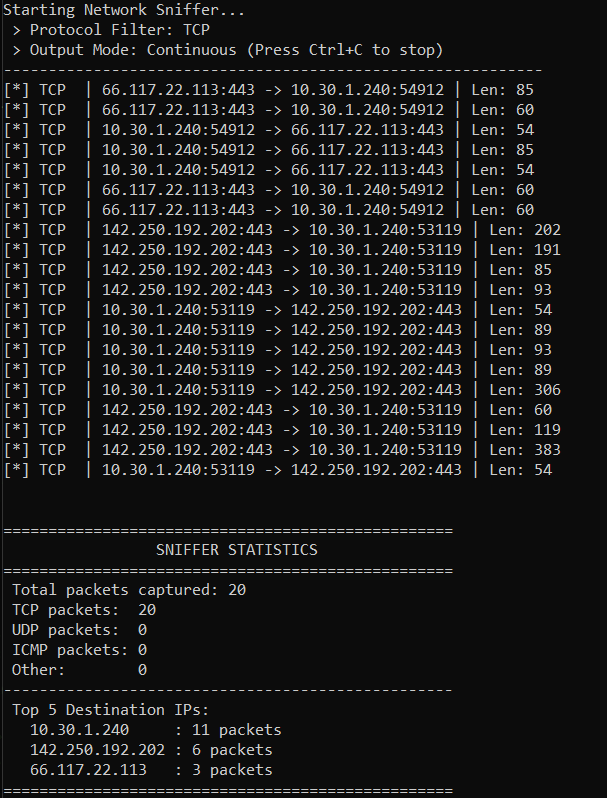

# 🛡️ Sentinel: Advanced Network Security Analyzer

[](https://www.python.org/)
[](https://scapy.net/)
[](https://customtkinter.tomschimansky.com/)
[](LICENSE)

## 📌 Project Overview
Sentinel is a robust, multi-threaded Network Packet Sniffer and Security Analyzer built in Python. Designed with an enterprise-grade **Event-Driven Architecture**, it completely decouples the core threat-detection business logic from the presentation layer, allowing it to be run via a Command-Line Interface (CLI) or a modern, dark-mode Graphical User Interface (GUI).

It continuously captures live network traffic, extracts deep packet metadata, and utilizes sliding-window heuristic analysis to detect rudimentary network anomalies such as rapid port scanning and high-frequency brute-force attempts.

---

## 📸 Dashboard Preview


---

## 🚀 Key Features
- **Dual-Interface Architecture:** Launch as a sleek, interactive GUI dashboard or a lightweight CLI tool. Both utilize the same underlying `PacketCaptureEngine` backend.
- **Thread-Safe UI Queues:** Implements background threading (`threading.Thread`) and data queues (`queue.Queue`) to prevent UI freezing during high-volume gigabit packet interception.
- **Real-Time Threat Detection:** 
  - *Port Scan Detection:* Identifies behavioral patterns where a single IP addresses multiple distinct ports within a short time frame.
  - *Brute-Force Heuristics:* Flags abnormally high-frequency connection attempts to single target ports.
- **Deep Packet Inspection:** Securely extracts protocol headers (TCP, UDP, ICMP), IPv4 addresses, active ports, and payload lengths using Scapy without memory-leaking buffering (`store=False`).
- **Data Exporting:** Native support for rotating log files (`RotatingFileHandler`) and binary `.pcap` exports for Wireshark integration.

## 💻 Tech Stack
- **Language:** Python 3.8+
- **Core Engine:** Scapy (Network manipulation and sniffing)
- **GUI Framework:** CustomTkinter (Modern, hardware-accelerated UI)
- **Architecture:** Model-View-Controller (MVC) inspired, Event-Driven Callbacks

## 📁 Folder Structure
```text
network_packet_sniffer/
├── config/
│   └── settings.py        # Centralized thresholds (No Magic Numbers!)
├── core/
│   ├── analyzer.py        # Threat heuristic logic (SRP compliant)
│   └── capture.py         # Scapy network interception engine
├── cli.py                 # Command-line interface driver
├── gui.py                 # CustomTkinter GUI driver
├── test_packet_sniffer.py # Automated unit testing
└── README.md              # Professional documentation
```

## 🛠️ Setup Instructions
1. Clone the repository and navigate to the directory.
2. Install dependencies:
   ```bash
   pip install scapy customtkinter
   ```
3. **OS-Level Driver Requirements:** 
   - Windows: Install [Npcap](https://npcap.com/) in WinPcap API-compatible Mode.
   - Linux: Run `sudo apt-get install libpcap-dev`

## 🏃‍♂️ Usage Instructions
*Note: Packet sniffing requires Administrator (Windows) or Root (Linux) privileges.*

### Option A: Launch the GUI (Recommended)
```bash
python gui.py
```
*Use the left sidebar to set protocol/port filters, toggle PCAP exporting, and start/stop the capture engine.*

### Option B: Launch the CLI 
```bash
# Filter only TCP traffic targeting port 443
python cli.py --protocol tcp --port 443

# Capture exactly 500 packets and save to a custom log file
python cli.py --count 500 --log secure_capture.log
```

## ✅ Unit Testing
The project includes an automated test suite utilizing Python's `unittest` framework to verify threat-detection logic without requiring live network attacks.
```bash
python test_packet_sniffer.py
```

## ⚖️ Ethical Disclaimer
This tool was developed strictly for educational purposes and authorized network diagnostics. Never run packet sniffers on networks you do not own or do not have explicit, written permission to analyze.
